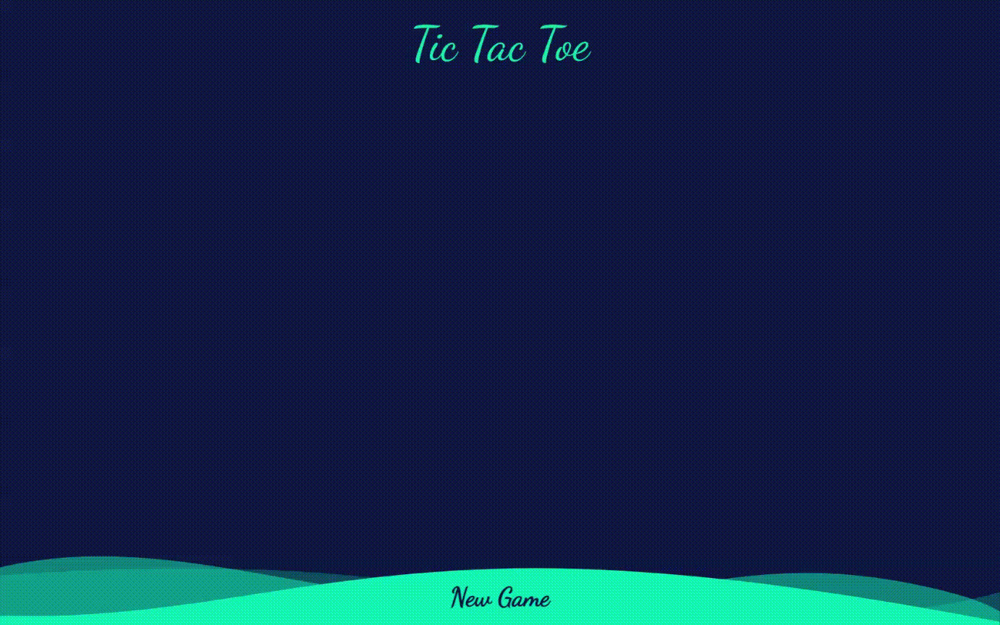

# Tic-tac-toe

Open tic-tac-toe App under the [Link](https://wblachut.github.io/TicTacToe_TheOdinProject/) !

##

## PROJECT: TIC-TAC-TOE

## Description

Project is a part of The Odin Project [JavaScript learning curriculum](https://www.theodinproject.com/courses/javascript). To learn more open the [TOP assignment page](https://www.theodinproject.com/courses/javascript/lessons/tic-tac-toe-javascript).

Tic tac to web app. You can choose to play versus AI or with you fiend by taking turns.

Multiplayer:

Single Player:

## Concepts used and learned:

- DOM manipulation
- ES6 Modules
- JS Objects, factory functions

## Tools:

- Visual Studio Code
- Javascript
- CSS3
- HTML5

## Possible updates in future:

- make hover effect showing X or O depending on turn
- make color picking option for players
- add page animations
- make AI Unbeatable (add easy and hard option)
